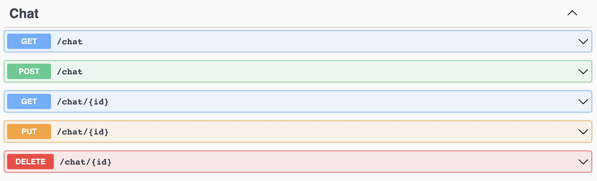
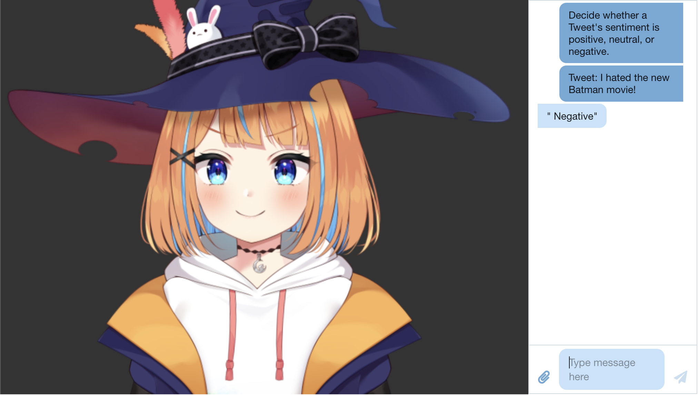
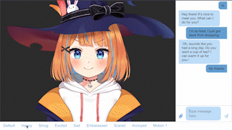

# AI Waifu 
Current version (15% done): [AI-Waifu-Website](http://35.175.110.252:3000/)     Are you lonely?  Do you need a friend?  Because I DO.  Inspired by *chatgpt* and *vtubers*, I attempt to create a virtual FRIEND on the browser.  I'll also be learning **C#** and **.NET** for the first time!  Below are pictures of the progress I'm making *(I sure hope my employers dont see this...)*
 <table><tr><tr>
            <td valign="bottom">
             
            model.gif | Feb 04 2023
            </td>
            <td valign="bottom">
             
            CRUD.png | Feb 05 2023
            </td>
            <td valign="bottom">
             
            SimpleChat.png | Feb 06 2023
            </td>
            <td valign="bottom">
             
            Expressions.gif | Feb 08 2023
            </td></tr><tr>
            <td valign="bottom">
             
            SentimentAnalysis.gif | Feb 09 2023
            </td>
            <td valign="bottom">
             
            MouthRigging.gif | Feb 20 2023
            </td>
            <td valign="bottom">
             
            SheSpeaks!.gif | Feb 20 2023
            </td></tr></table>

## Roadmap

- [x] Create a simple UI with model and chat
- [x] Implement Text to Text controller
- [x] Dockerize application
- [x] Deploy to cloud
- [ ] Implement Text to Speech controller.
# Journal

## Feb 4
* Loaded in model.  SHE IS SO PRETTYY!! I'm still in disbelief how advanced technology as come...

## Feb 5
* Created backend in Node.js, but then I realized I wanted to try .NET, so I converted to .NET.  
* Watched a 3 hour long tutorial to set up a simple backend and MongoDB database.
* Installed Postman to test out the Api

## Feb 6
* Added a simple chat ui using some chat ui package.  Spent about 3 hours just trying to align the canvas and chat side by side (My css skills suck)
* Added a new text to text controller in the backend that sends a new message DTO.
  
## Feb 7
* Wrote a really long prompt about the waifu, containing personality traits, lore, family, hobbies, occupation, and flaws.
* Injected openai api dependency into text to text controller.  Using above prompt to create completions and then storing the content within a message DTO to send.
* Asked her to play league with me and she said no T-T

## Feb 8
* Didn't get to work on it much today since I was out.  I did look into how to manipulate the model and found 8 different expressions and 1 motion that I can work with.  Haven't figured out how to move her mouth yet.

## Feb 9
* Wrote a new prompt for the openai chat model on classifying emotions of a text message.  Now, in addition to the message, the Text-Text endpoint will also return an emotion associated with the message.  SHE NOW HAS EXPRESSIONS ADN EMOTIONS!!!!K WAIUDJNAWKDNKAWJNDWK

## Feb 12
* I was inactive for a while.  I was touching grass for the first time this year.  Now I'm currently chilling at a university for a week for fun, so I should have a lot more time to grind on making her.  Lets get this bread!

## Feb 13
* Migrated all controller methods from synchronous to asynchronous since we are making requests to OpenAI Api.  
* Spent about 6 hours trying to containerize the backend as a docker image, and its still not working.  Please help.
* Hello, its been 10 hours now.  I FINALLY GOT THE DOCKER FILE TO WORK!!!  The fix was super dumb, I just had to change my directory to the backend rather than project root, then generate a dockerfile...
* Did the dockerfile for the frontend, it worked first try... now that I have dockerfiles done, I'm going to try and deploy first version to web tmr.

## Feb 14
* I'm a bit annoyed.  I have a prompt folder for all my prompts, but for some reason it doesn't work in the docker container because my prompts cannot be found.  I'm forced to put the prompts inline, so now the controllers look ugly T-T.
* Ran into a problem where no cloud provider (Heroku, Azure, DigitalOcean) would allow my backend to work.  It seems that it is because the cloud is amd64 while my docker container runs on arm64.  This is one of the rare times when I regret getting an M1 Mac...

## Feb 15
* Using docker-compose to manage the docker containers.  Ran into CORS problems but fixed it by adding my own policy and enabling CORS in the backend.
* LETS GOOO, WAS FINALLY ABLE TO DEPLOY EARLY PROTOTYPE OF HER!  ONLY TOOK *looks at watch* 4 DAYS OF SUFFERING!

## Feb 20
* Holy cow I was so dead after my trip that I didn't do anything for a few days.  I was OUT.  Today, I decided to be productive so I learned about model rigging and animations in Live2d and was able to create a few nice speaking animations.  It was so freaking hard, and I'm in utter awe at people who rig vtuber models... You guys are crazy.

## Feb 26
* I finally got Azure TTS working in the backend so now you can hear her voice in your speaker!!! Well, not just yet since I still haven't deployed it on AWS.  I struggled alot on figuring out how to play audio from a byte array onto the browser using javascript, but it turned out to be really easy.  You just append a certain prefix to the byte array.